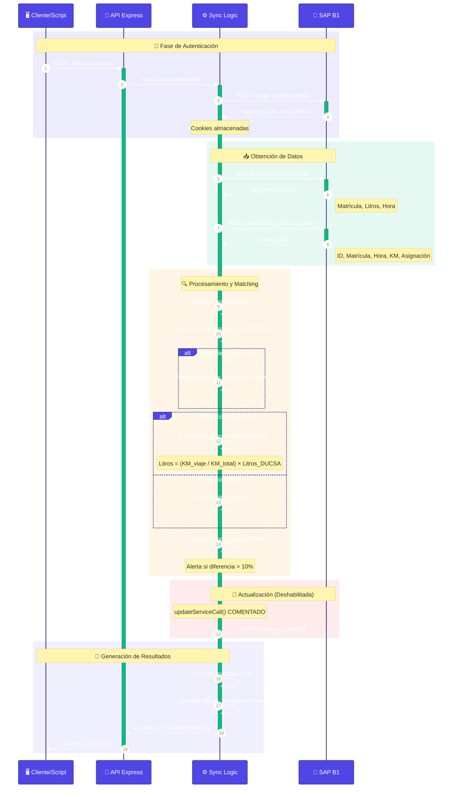

## 📊 Diagrama de Flujo del Proceso

```mermaid
%%{init: {'theme':'base', 'themeVariables': {'primaryColor':'#4F46E5','primaryTextColor':'#fff','primaryBorderColor':'#312E81','lineColor':'#6366F1','secondaryColor':'#10B981','tertiaryColor':'#F59E0B'}}}%%
sequenceDiagram
    autonumber
    participant Cliente as 🖥️ Cliente/Script
    participant API as 🚀 API Express
    participant Logic as ⚙️ Sync Logic
    participant SAP as 🏢 SAP B1
    
    rect rgb(79, 70, 229, 0.1)
        Note over Cliente,SAP: 🔐 Fase de Autenticación
        Cliente->>+API: POST /api/sync-ducsa
        API->>+Logic: syncDucsaLiters(date)
        Logic->>+SAP: POST /Login (credenciales)
        SAP-->>-Logic: ✅ B1SESSION + ROUTEID
        Note over Logic: Cookies almacenadas
    end
    
    rect rgb(16, 185, 129, 0.1)
        Note over Logic,SAP: 📥 Obtención de Datos
        Logic->>+SAP: GET /DUCSA (fecha ±1 día)
        SAP-->>-Logic: Registros DUCSA
        Note right of SAP: Matrícula, Litros, Hora
        
        Logic->>+SAP: GET /ServiceCalls (fecha ±2 días)
        SAP-->>-Logic: ServiceCalls
        Note right of SAP: ID, Matrícula, Hora, KM, Asignación
    end
    
    rect rgb(245, 158, 11, 0.1)
        Note over Logic: 🔍 Procesamiento y Matching
        Logic->>Logic: Mapear por Matrícula
        Logic->>Logic: Mapear por Asignación (U_IDASIG)
        
        alt Múltiples viajes mismo día
            Logic->>Logic: Seleccionar más cercano por hora
        end
        
        alt Viaje con Asignación
            Logic->>Logic: 📊 Prorratear litros según distancia
            Note over Logic: Litros = (KM_viaje / KM_total) × Litros_DUCSA
        else Viaje individual
            Logic->>Logic: Asignar litros totales
        end
        
        Logic->>Logic: ⚠️ Comparar con U_LitrosChofer
        Note over Logic: Alerta si diferencia > 10%
    end
    
    rect rgb(239, 68, 68, 0.1)
        Note over Logic,SAP: 💾 Actualización (Deshabilitada)
        Note over Logic: updateServiceCall() COMENTADO
        Logic--xSAP: PATCH /ServiceCalls(ID)
    end
    
    rect rgb(99, 102, 241, 0.1)
        Note over Logic,Cliente: 📄 Generación de Resultados
        Logic->>Logic: Guardar matches.json
        Logic->>Logic: Guardar debug_comparison.json
        Logic-->>-API: {summary, matches, missing}
        API-->>-Cliente: ✅ Respuesta JSON
    end
```
